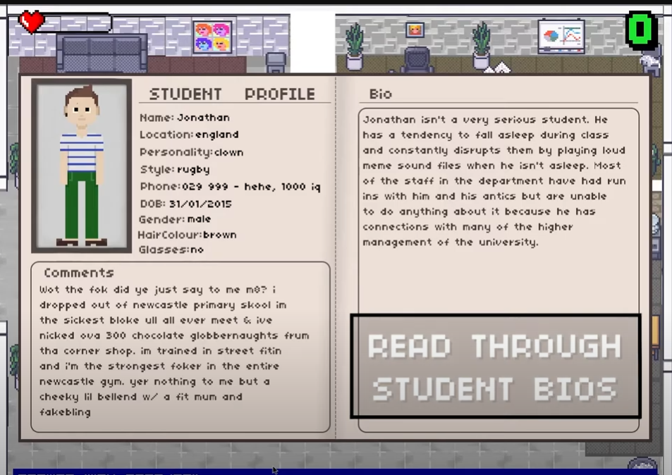

# Text Based Pygame Project

Text based game using python. The secret key json has been removed so will not work locally but the .exe file should as google sheets has been replaced for csv files.  A trailer has been included so you can see gameplay.

To clone this repository, make sure you have git installed.
Open a terminal and clone the repository.

## Trailer

### Click Image to watch youtube trailer

**Requirements**

In order to run the game, you will need Python 3.7.x installed. You will also need to install the following modules:

- gspread
- oauth2Client
- PyOpenSSL
- PyGame
- pandas

This can be done using the following command:
`python -m pip install gspread oauth2Client PyOpenSSL pygame pandas`

To check that you have the required dependencies, you can use module_checker.py within the _Game directory. 